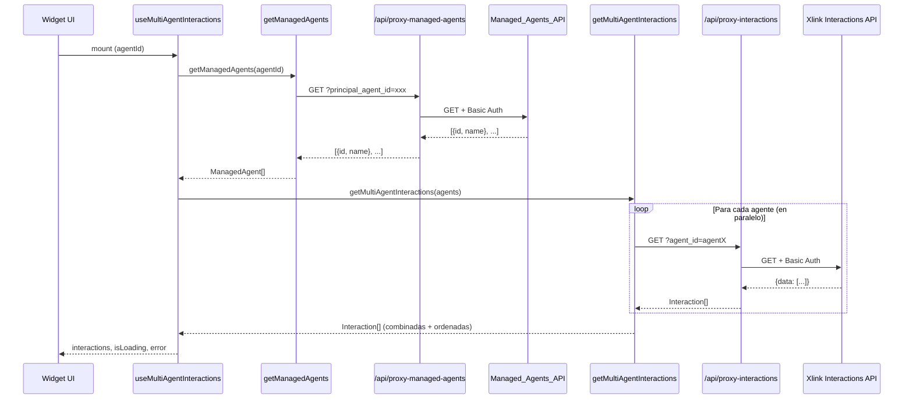

# Design Document: Multi-Agent Interactions

## Overview

Esta feature extiende el Conversation Parking Widget para que un agente principal (administrador/supervisor) pueda visualizar y gestionar las interacciones de todos los agentes bajo su administración desde una vista unificada.

El diseño introduce:
1. Una nueva ruta proxy (`/api/proxy-managed-agents`) que consulta la API externa de agentes administrados
2. Un nuevo puerto y servicio de dominio para obtener agentes administrados
3. Un use case de consulta paralela de interacciones para múltiples agentes
4. Un sistema de filtrado combinado (agente, estado de parqueo, línea de origen, texto libre)
5. Extensión del componente `InteractionCard` para mostrar el nombre del agente propietario

### Decisiones de Diseño Clave

| Decisión | Justificación |
|----------|---------------|
| Consulta paralela con `Promise.allSettled` | Permite obtener resultados parciales si algún agente falla, sin bloquear toda la vista |
| Filtrado en cliente | Las interacciones ya están en memoria; filtrar en cliente evita llamadas adicionales al servidor y ofrece respuesta instantánea |
| Nuevo puerto `ManagedAgentService` | Mantiene la arquitectura hexagonal — el dominio no conoce detalles de la API externa |
| Reutilización del `InteractionService` existente | La consulta de interacciones por agente ya existe; solo se invoca N veces en paralelo |
| Almacenamiento en memoria (hook state) | Consistente con el patrón actual del widget — no hay persistencia local |

## Architecture

```mermaid
graph TD
    subgraph Presentation
        FP[FilterPanel]
        IL[InteractionList]
        IC[InteractionCard]
    end

    subgraph Application
        UMA[useManagedAgents hook]
        UMAI[useMultiAgentInteractions hook]
        UF[useInteractionFilters hook]
        GMA[getManagedAgents use-case]
        GMAI[getMultiAgentInteractions use-case]
        FI[filterInteractions use-case]
    end

    subgraph Domain
        MA[ManagedAgent entity]
        INT[Interaction entity]
        MAS[ManagedAgentService port]
        IS[InteractionService port]
    end

    subgraph Infrastructure
        RMAS[RealManagedAgentService]
        RIS[RealInteractionService]
        SR[ServiceRegistry]
    end

    subgraph "Next.js API Routes"
        PMA[/api/proxy-managed-agents]
        PI[/api/proxy-interactions]
    end

    subgraph External
        XAPI[Managed_Agents_API]
        IAPI[Xlink Interactions API]
    end

    FP --> UF
    IL --> UMAI
    IC --> INT

    UMA --> GMA
    UMAI --> UMA
    UMAI --> GMAI
    UF --> UMAI

    GMA --> MAS
    GMAI --> IS

    RMAS --> PMA
    RIS --> PI
    SR --> RMAS
    SR --> RIS

    PMA --> XAPI
    PI --> IAPI
```

### Flujo de Datos



## Components and Interfaces

### Domain Layer

#### Nueva Entidad: `ManagedAgent`

```typescript
// src/domain/entities/managed-agent.ts
export interface ManagedAgent {
  id: string;
  name: string;
}
```

#### Nuevo Puerto: `ManagedAgentService`

```typescript
// src/domain/ports/managed-agent-service.port.ts
import { ManagedAgent } from '../entities/managed-agent';

export interface ManagedAgentService {
  getManagedAgents(principalAgentId: string): Promise<ManagedAgent[]>;
}
```

### Infrastructure Layer

#### Nuevo Servicio: `RealManagedAgentService`

```typescript
// src/infrastructure/services/real-managed-agent.service.ts
import { ManagedAgentService } from '../../domain/ports/managed-agent-service.port';
import { ManagedAgent } from '../../domain/entities/managed-agent';

export class RealManagedAgentService implements ManagedAgentService {
  async getManagedAgents(principalAgentId: string): Promise<ManagedAgent[]> {
    const response = await fetch(
      `/api/proxy-managed-agents?principal_agent_id=${encodeURIComponent(principalAgentId)}`
    );

    if (!response.ok) {
      throw new Error(`Failed to fetch managed agents: ${response.status}`);
    }

    const data: ManagedAgent[] = await response.json();
    return data;
  }
}
```

#### Service Registry (extensión)

```typescript
// Agregar a src/infrastructure/config/service-registry.ts
import { ManagedAgentService } from '../../domain/ports/managed-agent-service.port';
import { RealManagedAgentService } from '../services/real-managed-agent.service';

const managedAgentService: ManagedAgentService = new RealManagedAgentService();

export function getManagedAgentService(): ManagedAgentService {
  return managedAgentService;
}
```

### Application Layer

#### Use Case: `getManagedAgents`

```typescript
// src/application/use-cases/get-managed-agents.ts
import { ManagedAgentService } from '../../domain/ports/managed-agent-service.port';
import { ManagedAgent } from '../../domain/entities/managed-agent';

export async function getManagedAgents(
  service: ManagedAgentService,
  principalAgentId: string
): Promise<ManagedAgent[]> {
  return service.getManagedAgents(principalAgentId);
}
```

#### Use Case: `getMultiAgentInteractions`

```typescript
// src/application/use-cases/get-multi-agent-interactions.ts
import { InteractionService } from '../../domain/ports/interaction-service.port';
import { Interaction } from '../../domain/entities/interaction';
import { ManagedAgent } from '../../domain/entities/managed-agent';

export interface MultiAgentResult {
  interactions: Interaction[];
  failedAgentIds: string[];
}

export async function getMultiAgentInteractions(
  service: InteractionService,
  agents: ManagedAgent[]
): Promise<MultiAgentResult> {
  const results = await Promise.allSettled(
    agents.map(async (agent) => {
      const interactions = await service.getInteractions(agent.id);
      return interactions.map((interaction) => ({
        ...interaction,
        agentId: interaction.agentId ?? agent.id,
        agentName: interaction.agentName ?? agent.name,
      }));
    })
  );

  const interactions: Interaction[] = [];
  const failedAgentIds: string[] = [];

  results.forEach((result, index) => {
    if (result.status === 'fulfilled') {
      interactions.push(...result.value);
    } else {
      failedAgentIds.push(agents[index].id);
    }
  });

  // Ordenar por startTimestamp descendente
  interactions.sort(
    (a, b) => new Date(b.startTimestamp).getTime() - new Date(a.startTimestamp).getTime()
  );

  return { interactions, failedAgentIds };
}
```

#### Use Case: `filterInteractions`

```typescript
// src/application/use-cases/filter-interactions.ts
import { Interaction } from '../../domain/entities/interaction';

export interface InteractionFilters {
  agentId: string | null;       // null = todos
  parkingStatus: 'all' | 'parked' | 'active';
  originLine: string | null;    // null = todas
  searchText: string;           // '' = sin filtro
}

export const DEFAULT_FILTERS: InteractionFilters = {
  agentId: null,
  parkingStatus: 'all',
  originLine: null,
  searchText: '',
};

export function filterInteractions(
  interactions: Interaction[],
  filters: InteractionFilters
): Interaction[] {
  return interactions.filter((interaction) => {
    // Filtro por agente
    if (filters.agentId && interaction.agentId !== filters.agentId) {
      return false;
    }

    // Filtro por estado de parqueo
    if (filters.parkingStatus === 'parked' && !interaction.isParked) {
      return false;
    }
    if (filters.parkingStatus === 'active' && interaction.isParked) {
      return false;
    }

    // Filtro por línea de origen
    if (filters.originLine && interaction.originLine !== filters.originLine) {
      return false;
    }

    // Filtro por texto libre (case-insensitive)
    if (filters.searchText.trim()) {
      const search = filters.searchText.toLowerCase();
      const matchesClient = interaction.clientName?.toLowerCase().includes(search) ?? false;
      const matchesDestination = interaction.destinationLine.toLowerCase().includes(search);
      if (!matchesClient && !matchesDestination) {
        return false;
      }
    }

    return true;
  });
}
```

#### Hook: `useManagedAgents`

```typescript
// src/application/hooks/useManagedAgents.ts
```

Responsabilidades:
- Invocar `getManagedAgents` al montar cuando `principalAgentId` está disponible
- Exponer: `agents: ManagedAgent[]`, `isLoading: boolean`, `error: string | null`, `retry: () => void`

#### Hook: `useMultiAgentInteractions`

```typescript
// src/application/hooks/useMultiAgentInteractions.ts
```

Responsabilidades:
- Depender de `useManagedAgents` para obtener la lista de agentes
- Invocar `getMultiAgentInteractions` cuando los agentes están disponibles
- Notificar vía toast si hay agentes fallidos
- Exponer: `interactions: Interaction[]`, `isLoading: boolean`, `error: string | null`, `failedCount: number`, `retry: () => void`

#### Hook: `useInteractionFilters`

```typescript
// src/application/hooks/useInteractionFilters.ts
```

Responsabilidades:
- Mantener el estado de los filtros (`InteractionFilters`)
- Aplicar `filterInteractions` sobre la lista de interacciones
- Exponer: `filters`, `setFilter(key, value)`, `resetFilters()`, `filteredInteractions`, `visibleCount`

### Presentation Layer

#### Nuevo Componente: `FilterPanel`

```typescript
// src/presentation/components/FilterPanel.tsx
```

Props:
- `agents: ManagedAgent[]` — lista para el selector de agentes
- `originLines: string[]` — líneas únicas extraídas de interacciones
- `filters: InteractionFilters` — estado actual de filtros
- `onFilterChange: (key, value) => void` — callback para cambiar un filtro
- `onReset: () => void` — callback para limpiar filtros
- `visibleCount: number` — conteo de interacciones visibles

Elementos UI:
- Select "Agente" con opción "Todos los agentes"
- Select "Estado" con opciones "Todas", "Parqueadas", "Activas"
- Select "Línea de origen" con opción "Todas las líneas"
- Input de texto con placeholder "Buscar por cliente o número..."
- Botón "Limpiar filtros"
- Badge con conteo de resultados

#### Extensión de `InteractionCard`

Se agrega la visualización del nombre del agente propietario de forma prominente en cada tarjeta:
- Si `agentName` está definido: mostrar el nombre
- Si `agentName` no está definido: mostrar "Agente desconocido"

### API Route

#### `/api/proxy-managed-agents/route.ts`

```typescript
// app/api/proxy-managed-agents/route.ts
```

- Método: GET
- Query params: `principal_agent_id` (requerido)
- Autenticación: Basic Auth server-side (mismas credenciales que otros proxies)
- Respuesta: `ManagedAgent[]` (array de `{ id: string, name: string }`)
- Errores: 400 si falta `principal_agent_id`, 502 si la API externa falla

## Data Models

### Entidades de Dominio

```typescript
// Existente — sin cambios
interface Interaction {
  id: string;
  originLine: string;
  destinationLine: string;
  startTimestamp: string; // ISO 8601
  isParked: boolean;
  clientName?: string;
  agentId?: string;
  agentName?: string;
  queueId?: string;
}

// Nueva entidad
interface ManagedAgent {
  id: string;
  name: string;
}
```

### Modelo de Filtros

```typescript
interface InteractionFilters {
  agentId: string | null;
  parkingStatus: 'all' | 'parked' | 'active';
  originLine: string | null;
  searchText: string;
}
```

### Respuesta de API Externa (Managed_Agents_API)

```typescript
// Respuesta esperada del endpoint externo
type ManagedAgentsApiResponse = Array<{
  id: string;
  name: string;
}>;
```

### Resultado de Consulta Multi-Agente

```typescript
interface MultiAgentResult {
  interactions: Interaction[];
  failedAgentIds: string[];
}
```

## Correctness Properties

*A property is a characteristic or behavior that should hold true across all valid executions of a system — essentially, a formal statement about what the system should do. Properties serve as the bridge between human-readable specifications and machine-verifiable correctness guarantees.*

### Property 1: Combined interactions are sorted by timestamp descending

*For any* set of interactions obtained from multiple agents (with arbitrary timestamps), the combined result list SHALL always be sorted by `startTimestamp` in descending order (most recent first).

**Validates: Requirements 2.2**

### Property 2: Partial failure preserves successful results

*For any* list of managed agents where some succeed and some fail when querying interactions, the result SHALL contain all interactions from successful agents and the `failedAgentIds` array SHALL contain exactly the IDs of agents whose queries failed.

**Validates: Requirements 2.3**

### Property 3: Agent name enrichment from API

*For any* managed agent and any interaction returned for that agent, if the interaction does not already have an `agentName`, the system SHALL enrich it with the `name` from the corresponding `ManagedAgent` record.

**Validates: Requirements 3.3**

### Property 4: Agent filter returns only matching interactions

*For any* set of interactions with various `agentId` values and any selected agent filter value, the filtered result SHALL contain only interactions whose `agentId` equals the selected value. When the filter is null (all agents), all interactions SHALL be returned.

**Validates: Requirements 4.2, 4.3**

### Property 5: Parking status filter correctness

*For any* set of interactions with mixed `isParked` values, when the parking status filter is "parked" all results SHALL have `isParked === true`, and when the filter is "active" all results SHALL have `isParked === false`. When the filter is "all", all interactions SHALL be returned unchanged.

**Validates: Requirements 5.2, 5.3**

### Property 6: Origin line filter returns only matching interactions

*For any* set of interactions with various `originLine` values and any selected origin line filter, the filtered result SHALL contain only interactions whose `originLine` equals the selected value. When the filter is null, all interactions SHALL be returned.

**Validates: Requirements 6.2**

### Property 7: Text search matches clientName or destinationLine case-insensitively

*For any* set of interactions and any non-empty search string, the filtered result SHALL contain only interactions where `clientName` or `destinationLine` contains the search string (case-insensitive comparison). When the search string is empty, all interactions SHALL pass the text filter.

**Validates: Requirements 7.2, 7.3**

### Property 8: Conjunctive filter composition (AND logic)

*For any* set of interactions and any combination of active filters (agent, parking status, origin line, search text), every interaction in the filtered result SHALL satisfy ALL active filter criteria simultaneously. The filtered result SHALL be equivalent to the intersection of applying each filter independently.

**Validates: Requirements 8.1**

### Property 9: Unique origin lines extraction

*For any* set of interactions, the extracted origin lines list SHALL contain no duplicates and SHALL contain every distinct `originLine` value present in the interactions.

**Validates: Requirements 6.1**

## Error Handling

### Proxy Route Errors (`/api/proxy-managed-agents`)

| Escenario | Código HTTP | Respuesta |
|-----------|-------------|-----------|
| Falta `principal_agent_id` | 400 | `{ error: "Missing required query parameter: principal_agent_id" }` |
| API externa no disponible | 502 | `{ error: "Failed to reach external API" }` |
| API externa retorna error HTTP | 502 | `{ error: "External API error: {status}" }` |
| Éxito | 200 | `ManagedAgent[]` |

### Hook `useManagedAgents` Errors

| Escenario | Comportamiento |
|-----------|----------------|
| Fetch falla (red, timeout) | `error` se setea con mensaje descriptivo, UI muestra error + botón reintento |
| Respuesta vacía | `agents` es array vacío, UI muestra estado vacío |
| `principalAgentId` es null | No se ejecuta fetch, `agents` permanece vacío |

### Hook `useMultiAgentInteractions` Errors

| Escenario | Comportamiento |
|-----------|----------------|
| Todos los agentes fallan | `error` se setea, UI muestra error general + botón reintento |
| Algunos agentes fallan | `interactions` contiene resultados parciales, toast de advertencia con conteo de fallos |
| Lista de agentes vacía | `interactions` es array vacío, no se ejecutan queries |

### Estrategia de Reintentos

- No hay retry automático — el usuario controla cuándo reintentar
- Botón "Reintentar" en estados de error re-ejecuta la operación completa
- Botón flotante de refrescar re-consulta todas las interacciones

## Testing Strategy

### Enfoque Dual: Unit Tests + Property-Based Tests

Este feature es adecuado para property-based testing porque:
- Los use cases `filterInteractions` y `getMultiAgentInteractions` son funciones puras con comportamiento que varía significativamente con los inputs
- El espacio de inputs es grande (combinaciones de filtros × interacciones × agentes)
- Las propiedades son universales (deben cumplirse para cualquier input válido)
- La ejecución es económica (funciones puras en memoria, sin I/O)

### Property-Based Tests (fast-check)

**Librería:** `fast-check` (ya instalada en el proyecto)
**Configuración:** Mínimo 100 iteraciones por propiedad
**Ubicación:** `__tests__/application/filter-interactions.property.test.ts` y `__tests__/application/get-multi-agent-interactions.property.test.ts`

Cada test debe incluir un comentario de tag:
```typescript
// Feature: multi-agent-interactions, Property {N}: {título}
```

**Propiedades a implementar:**
1. Sorting invariant (Property 1)
2. Partial failure resilience (Property 2)
3. Agent name enrichment (Property 3)
4. Agent filter correctness (Property 4)
5. Parking status filter correctness (Property 5)
6. Origin line filter correctness (Property 6)
7. Text search filter correctness (Property 7)
8. Conjunctive filter composition (Property 8)
9. Unique origin lines extraction (Property 9)

### Unit Tests (Vitest)

**Ubicación:** Co-ubicados con el archivo fuente (`*.test.ts`)

| Componente | Tests |
|------------|-------|
| `filter-interactions.ts` | Casos específicos: filtros vacíos, un solo filtro activo, edge cases (lista vacía, sin clientName) |
| `get-multi-agent-interactions.ts` | Caso de éxito total, caso de fallo total, caso mixto |
| `get-managed-agents.ts` | Caso de éxito, caso de error |
| `useManagedAgents` hook | Estados de loading, error, éxito, retry |
| `useMultiAgentInteractions` hook | Integración con useManagedAgents, toast en fallos parciales |
| `FilterPanel` component | Renderizado de opciones, interacciones de usuario |
| `InteractionCard` (extensión) | Muestra agentName, muestra "Agente desconocido" |

### Integration Tests

**Ubicación:** `__tests__/integration/`

| Test | Descripción |
|------|-------------|
| Proxy route | Verifica que `/api/proxy-managed-agents` reenvía correctamente con Basic Auth |
| Flujo completo | Verifica el flujo desde auth → managed agents → interactions → filtrado |

### Mocking Strategy

- **MSW** para mockear las rutas proxy en tests de hooks y componentes
- **Mocks manuales** del service registry para tests de use cases puros
- **fast-check arbitraries** para generar `Interaction[]` y `ManagedAgent[]` aleatorios

### Generators (fast-check Arbitraries)

```typescript
// Arbitrary para ManagedAgent
const managedAgentArb = fc.record({
  id: fc.uuid(),
  name: fc.string({ minLength: 1, maxLength: 50 }),
});

// Arbitrary para Interaction
const interactionArb = fc.record({
  id: fc.uuid(),
  originLine: fc.stringMatching(/^\+?\d{10,15}$/),
  destinationLine: fc.stringMatching(/^\+?\d{10,15}$/),
  startTimestamp: fc.date().map(d => d.toISOString()),
  isParked: fc.boolean(),
  clientName: fc.option(fc.string({ minLength: 1 }), { nil: undefined }),
  agentId: fc.option(fc.uuid(), { nil: undefined }),
  agentName: fc.option(fc.string({ minLength: 1 }), { nil: undefined }),
  queueId: fc.option(fc.uuid(), { nil: undefined }),
});

// Arbitrary para InteractionFilters
const filtersArb = fc.record({
  agentId: fc.option(fc.uuid(), { nil: null }),
  parkingStatus: fc.constantFrom('all', 'parked', 'active'),
  originLine: fc.option(fc.stringMatching(/^\+?\d{10,15}$/), { nil: null }),
  searchText: fc.string({ maxLength: 20 }),
});
```

